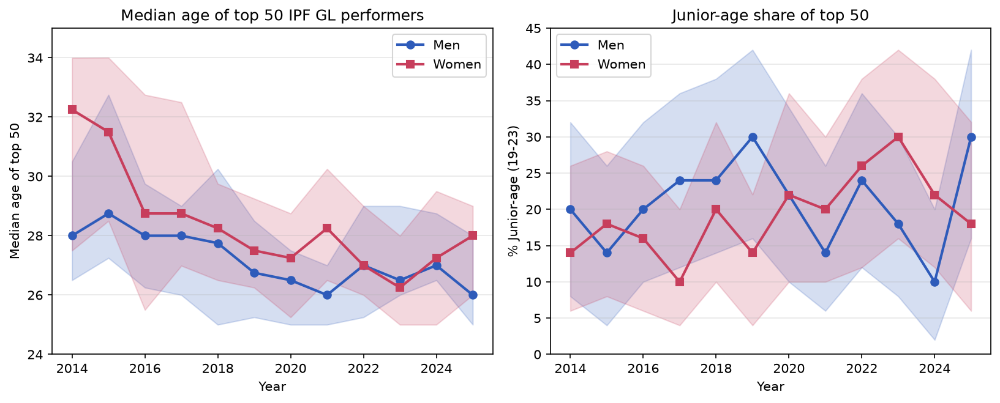
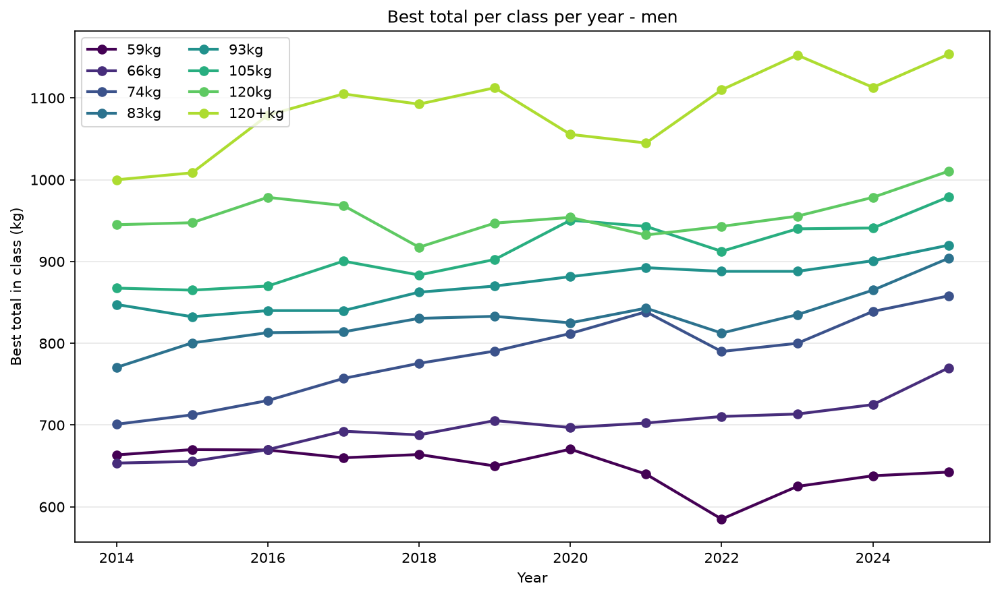

# Powerlifting Cohort Shift in IPF Raw Tested Powerlifting

A descriptive analysis of whether elite raw tested IPF powerlifters are reaching historically elite totals at junior and sub-junior ages, before the conventional peak window. Built on the OpenIPF bulk dataset (snapshot 2026-06-06), scoped to roughly 523,000 lifter-meets across 207,000 lifters from 2014 onward.

The central claim is precise: lifters are arriving at the top of their weight class years earlier than the mid-20s-and-up window where the best lifters have traditionally peaked. It is not the claim that the youngest lifters are now the outright best in every class.

Full writeup with figures, tables, methods, and limitations: [reports/writeup.md](reports/writeup.md)



## Findings

The primary analysis tracks, for each weight class, the lifter who posted the top total at a major meet each year, and that lifter's age. Three patterns coexist and are kept distinct.

Genuine junior and sub-junior takeovers appear in the lighter and middle men's classes. In 2026 the 59kg class was taken by Justin Nguyen, a 16-year-old sub-junior, with 670kg, the highest 59kg major-meet total of the past decade. The 83kg class was taken by Joseph Borenstein at 22 with 900kg, and the 93kg class by William Ball at 20 with 930kg. In each case the total is the best the class has recorded at major meets, not an impressive-for-age result.

The 74kg class is the reason the thesis is framed as age of arrival rather than youth as such. It is not a junior takeover. Austin Perkins has held it since 2024 and posted 891.5kg at Sheffield in 2026 at age 26, the highest 74kg total on record. He reached the top at 24 on the conventional timeline and is still rising. He serves as the benchmark for what reaching the top normally looks like, which is what makes the junior arrivals in the other classes legible.

The two heaviest classes have not shifted. At 105, 120, and 120+ kg the top totals still belong to lifters in their mid-to-late 20s.

Supporting population-level analyses agree. Implied peak age from rolling 3-year quadratic fits fell about 1.7 years for men (32.66 to 30.99) and 1.9 years for women (32.62 to 30.72), with non-overlapping 95% bootstrap intervals. Per-class winning totals rose in every men's weight class between 2017 and 2026, which argues against a pure retirement-and-selection explanation. On the all-time IPF GL leaderboard, 6 of the top 20 men are under 24, and the pooled median age of the elite tier fell for both sexes (1.6 years for men, 3.2 for women, both intervals excluding zero).

The women's result is reported as mixed. The cohort shift appears in the women's peak-age and median-age analyses but does not reach within-class dominance at major meets, where only Agata Sitko and Jade Jacob are under 24 in the top 20. This is a genuine finding about the difference between population drift and top-end turnover.



## Repo layout

```
.
├── README.md
├── requirements.txt
├── data/                                 # not tracked (see Data below)
│   ├── openipf-YYYY-MM-DD/ or raw/        # OpenIPF bulk CSV
│   └── processed/                         # openipf_scoped.pkl, built by ingest.py
├── src/powerlifting_cohort/
│   ├── ingest.py                          # load CSV, apply scope filters, write pickle
│   ├── features.py                        # weight-class parsing, bodyweight-class reconstruction,
│   │                                      #   age category, division canonicalization, dedupe
│   └── bootstrap.py                       # bootstrap CIs: peak age, percentile diffs, median-age diffs
├── notebooks/
│   ├── 01_headline.ipynb                  # median age and junior-age share of the top 50 by GL
│   ├── 02_age_curve.ipynb                 # rolling 3-year quadratic fits, implied peak age
│   ├── 03_top_lifters_by_gl.ipynb         # all-time top 20 GL leaderboard
│   ├── 04_per_class_progression.ipynb     # best total per class per year, deltas, robustness
│   └── 05_succession_major_meets.ipynb    # class kingpins at major meets (primary analysis)
└── reports/
    ├── writeup.md
    └── figures/
```

## Setup

```bash
python -m venv .venv
source .venv/bin/activate          # Windows: .venv\Scripts\activate
pip install -r requirements.txt
```

## Data

The dataset is the OpenIPF bulk CSV (snapshot 2026-06-06), OpenPowerlifting filtered to IPF-affiliated federations. It is CC0 licensed and available at [openipf.org](https://www.openipf.org/). The raw CSV and the processed pickle are large and are not tracked in git; rebuild them locally.

Download the bulk CSV, place it under `data/` (for example `data/openipf-2026-06-06/openipf-2026-06-06-<hash>.csv`), then build the scoped pickle:

```bash
python src/powerlifting_cohort/ingest.py <path-to-csv> data/processed/openipf_scoped.pkl
```

With no arguments, `ingest.py` looks for the 2026-06-06 snapshot at its default path. A correct run reports `scoped: 598,980 rows`. Then run the notebooks in order (01 through 05); they read `data/processed/openipf_scoped.pkl` and write figures to `reports/figures/`.

## Scope

Raw equipment, full-power (squat-bench-deadlift) events, drug-tested meets, IPF affiliates only, and the IPF weight class system (53/59/66/74/83/93/105/120 kg for men, 43/47/52/57/63/69/76/84 kg for women). The class-system filter handles the 2022 USAPL/IPF schism without date logic: it includes USAPL pre-2022 (when IPF-affiliated) and excludes USAPL post-2022 (when not). Multi-bracket entries are deduplicated to one row per lifter-meet, keeping the most relevant division (Open over Junior over Sub-Junior).

One processing step is load-bearing. Sheffield and some invitational meets record bodyweight but not weight class, so those rows arrive with a missing class label. `features.py` reconstructs the class from bodyweight whenever the label is missing, recovering about 3,000 performances (including Perkins's Sheffield totals) that a label-only filter would silently drop.

## Notes

The analysis is descriptive; it does not estimate a causal effect. Totals reflect the best successful attempt, not maximum capacity, so head-to-head comparisons of recorded totals can mislead; junior totals are therefore compared against the history of their class rather than against current peers. "Tested" means a lifter passed an IPF affiliate's testing protocol at the time of competition, not "clean" in any absolute sense. The 2026 season is incomplete and is reported alongside the complete 2025 season.

## Author

William Le
