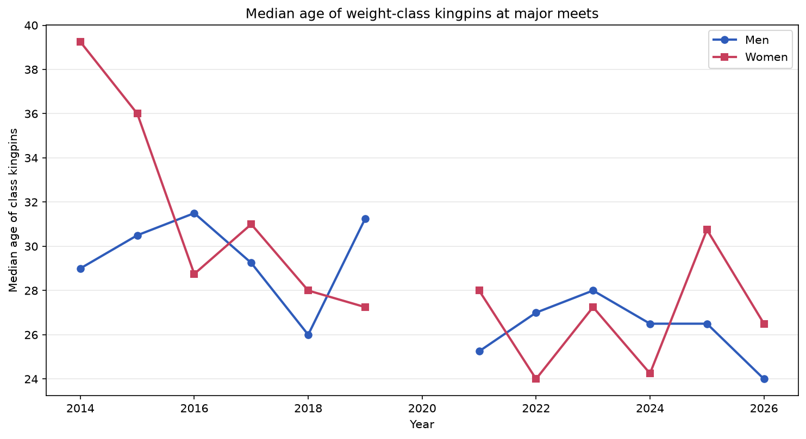
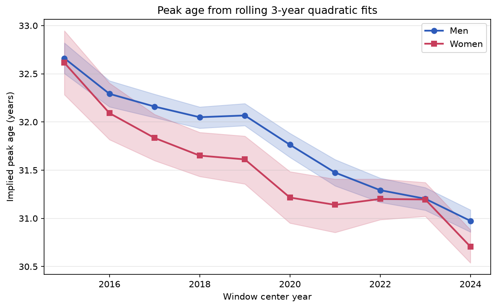

# Powerlifting Cohort Shift in IPF Raw Tested Powerlifting

William Le

## 1 Introduction

The conventional view places peak powerlifting performance in the late 20s to early 30s. That estimate was produced from cohorts that have largely cycled out of competition. Over the past two seasons a group of junior and sub-junior lifters have started posting the best total in their weight class at the sport's biggest meets, reaching that level years before the conventional peak window.

The clearest case is the 59kg class. Sergey Fedosienko held the top major-meet total in that class from 2014 through 2021, aging from 31 to 39, with a peak of 669.5kg. In May 2026 a sixteen-year-old, Justin Nguyen, posted 670kg at Age Division Nationals, exceeding Fedosienko's entire reign at less than half his age.

This project uses the OpenIPF bulk dataset to test whether that pattern holds across the sport. The central claim is precise: lifters are reaching historically elite totals at junior and sub-junior ages, before the mid-20s-and-up window where the best lifters have traditionally peaked. The claim is not that the youngest lifters are now the outright best in every class. In the 74kg class the best lifter is Austin Perkins, who reached the top at 24 on the conventional timeline and is still improving at 26. He serves as a benchmark for what reaching the top normally looks like, which is what makes the junior arrivals in the other classes legible.

The primary analysis (Section 4) tracks the top total in each weight class at major meets over time. Sections 5 through 7 add supporting evidence from peak-age curves, per-class strength progression, and the all-time leaderboard. Claims that depend on sampling are reported with 95% bootstrap confidence intervals (1000 resamples). The analysis is descriptive. I do not estimate a causal effect.

## 2 Data

The dataset is the OpenIPF bulk CSV (snapshot 2026-06-06), which is OpenPowerlifting filtered to IPF-affiliated federations. After scope filters, the analysis window from 2014 onward contains roughly 523,000 lifter-meets across 207,000 lifters.

Scope filters: raw equipment, full-power (squat-bench-deadlift) events, drug-tested meets, IPF affiliates only, and the IPF weight class system (53/59/66/74/83/93/105/120 kg for men and 43/47/52/57/63/69/76/84 kg for women).

Filtering on the IPF class system handles the 2022 USAPL/IPF schism without date logic. USAPL was the US IPF affiliate through January 2022 and used IPF classes during that period. After the split, USAPL returned to the legacy 82.5/90/100 kg system and Powerlifting America became the new IPF affiliate. The class-system filter therefore includes USAPL pre-2022 and excludes USAPL post-2022 automatically.

One processing step is load-bearing for the primary analysis. Sheffield and some invitational meets record bodyweight but not weight class, so those rows arrive with a missing class label. A class-based analysis that filters on the label silently drops every such performance, which removes some of the strongest lifters in the sport from their own classes, including Perkins, Olivares, and Sitko. The feature pipeline reconstructs the class from bodyweight using the IPF cutoffs whenever the label is missing and the bodyweight is present. This recovers about 3,000 performances that would otherwise be excluded.

Multi-bracket entries were deduplicated. Some federations record a single performance under multiple overlapping divisions, for example a 17-year-old placed in both the Open and Teen-2 brackets. Without deduplication the count of junior-age lifters in Open was inflated by approximately 4%. The dedup keeps the row with the most relevant division (Open over Junior over Sub-Junior) per lifter-date pair.

For age I use the lifter's actual age at meet time, not the division entered. A 21-year-old who entered Open is junior-age. Two data limitations are worth stating up front. OpenIPF stores age as half-integers (22.5) more often than integers, reflecting an inferred-age convention when the birth date is unknown, so the typical age observation carries about 0.5 years of measurement error. And "tested" means a lifter passed the testing protocols of an IPF affiliate at the time of competition, not "clean" in any absolute sense.

## 3 A note on the scoring metric

Most cross-class comparison in powerlifting uses IPF GL Points, a coefficient that normalizes total against bodyweight. GL is the federation's official scoring system and Sections 6 and 7 use it. It has a known distortion: it understates dominance in the heaviest classes. Jesus Olivares has posted the highest raw totals in history and has been untouchable at 120+ kg for years, yet his GL sits near 111 to 114, below middleweight lifters who are less dominant within their own class. A ranking by GL therefore partly measures which class a lifter is in rather than how good they are.

For this reason the primary analysis in Section 4 does not use GL. It works entirely within weight class, comparing totals only against other totals in the same class. The GL-based analyses are presented afterward as supporting evidence, with the distortion noted.

## 4 Finding 1: Class succession at major meets

The sharpest test of the thesis is to track, for each weight class, the lifter who posted the top total at a major meet each year, and that lifter's age. Major meets are the World Classic Championships, the Sheffield Powerlifting Championships, US Open and Raw Nationals, the European Classic Championships, and Age Division Nationals. These are the meets where the best lifters in a class compete. Worlds already contains the best lifter from each country, so national meets are included to capture the depth that the one-per-country cap at Worlds hides.

The genuine junior and sub-junior takeovers are concentrated in the lighter and middle men's classes. The table below shows the long-reigning holder in each, with age range, and the young lifter who took the class in 2025 or 2026.

| Class | Prior holder (age range) | 2025-26 taker | Age | Total |
|---|---|---|---|---|
| 59 | Sergey Fedosienko (31-39) | Justin Nguyen | 16, Sub-Junior | 670 |
| 66 | Open-age holders (26-36) | Austin Nikolai | 22, Junior | 710 |
| 83 | Orhii, Wallace (24-29) | Joseph Borenstein | 22, Junior | 900 |
| 93 | Jonathan Cayco (26-32) | William Ball | 20, Junior | 930 |

In each case the total is not strong-for-age. It is the best the class has recorded. Nguyen's 670kg at 16 exceeds every 59kg major-meet total since 2014. Borenstein's 900kg at 22 is the highest 83kg total at a major meet. Ball's 930kg at 20 is the highest at 93kg.

The 74kg class is a different case and is the reason the thesis is stated as age of arrival rather than youth as such. It is not a junior takeover. Austin Perkins has held the class since 2024 and posted 891.5kg at Sheffield in 2026 at age 26, the highest 74kg total on record. Perkins reached the top at 24 as an Open lifter, on the conventional timeline, and is still rising, having gone from 839 to 891.5 across three seasons. He is the better lifter in the class by a clear margin, and his 891.5 came on conservative attempts, so his true ceiling is higher than the recorded figure. The junior in this class, Elliott Sykes, posted 852.5kg at 19, a total that would have won the 74kg class at every prior major-meet year in the dataset. The significant fact is not that Sykes has surpassed Perkins, which he has not, but that a 19-year-old is posting a total that clears the open-class history of the class.

The two heaviest classes are the honest exception. At 105, 120, and 120+ kg the top totals belong to lifters in their mid-to-late 20s, with no junior takeover. Jesus Olivares at 120+ is a distinct pattern: he took the class as a junior at 22 in 2021 and has held it since, a young arrival that aged into a long reign rather than a recent handoff. Heavyweight powerlifting has long peaked later, which is consistent with the slower change in these classes.

The pooled median age of the men's class kingpins reflects all of this. It sat near 29 to 31 in 2014 to 2017, moved unevenly through the late 2010s, and reached 24 in 2026, the youngest in the series, though 2026 is a partial season and the kingpin set in any one year is only eight lifters, so the year-to-year figure is noisy. The signal is in the per-class lineages more than in the pooled median.

The women's kingpin age shows no trend. Outside of Agata Sitko, the women posting the top totals in their classes at major meets remain in their mid-20s to 30s. The cohort shift that appears in the women's population-level analyses below does not reach within-class dominance at the major meets, where the depth of young elite women is not yet sufficient to displace the established lifters.

## 5 Finding 2: Implied peak age

To check whether the underlying age-performance relationship has shifted at the population level, I fit

$$
\text{IPF GL} = \beta_0 + \beta_1 \cdot \text{Age} + \beta_2 \cdot \text{Age}^2 + \varepsilon
$$

via OLS on each rolling 3-year window, separately by sex, and computed the implied peak as $-\beta_1 / (2\beta_2)$. A 3-year window is the smallest that gives enough observations across the full age range to identify the curvature term.

Men's implied peak age fell from 32.66 [95% CI 32.51, 32.82] in the 2015 window to 30.99 [30.88, 31.11] in the 2024 window. Women's fell from 32.62 [32.26, 32.99] to 30.72 [30.54, 30.90]. Each window holds roughly 13,000 to 88,000 observations, with the women's windows at the smaller end, so the intervals are tight and the endpoints are separated by more than a full year with no overlap. Both curves decline monotonically. This measure is harder to attribute to selection than a median, because pure age-correlated dropout would shift the fitted peak later, not earlier. It uses GL, so it carries the caveat from Section 3 and is reported as corroborating.

## 6 Finding 3: Per-class strength has risen across the board

If the apparent youth shift were an artifact of older lifters retiring and leaving a younger field, the absolute totals posted today would resemble those of a decade ago. They do not.

Between 2017 and 2026 the winning total rose in every men's weight class: 59kg by 10kg, 66kg by 89.5kg, 74kg by 134.5kg, 83kg by 78.5kg, 93kg by 90kg, 105kg by 79.5kg, 120kg by 56.5kg, and 120+kg by 5kg. The largest gains are in the middle classes, which is where the youth arrivals are concentrated, and at 74kg, where Perkins has pushed the class record up sharply. Bootstrapping the 95th percentile of total per class, a more stable estimator than the single maximum, gives a shift whose 95% confidence interval excludes zero for every class.

The lifters who held these classes in the late 2010s are mostly still competing. Atwood moved from 74 to 83 kg. Rouska moved from 105 to 120 kg. Olivares stayed at 120+ kg and added weight to his own peak. They were not removed from the data; the bar moved up under them. This is the direct evidence against a pure-selection explanation for the cohort shift.

## 7 Finding 4: The GL leaderboard

Ranking all lifters by their single best career IPF GL performance, 6 of the top 20 men are under age 24 (Sykes, Borenstein, Ball, Rouska, Lowe, Marichev), with the youngest entries clustered at the very top of the list and the remaining places held by lifters in their late 20s and early 30s. On the population side, the median age of the top 50 lifters by GL each year fell over the period. Because single-year medians of a 50-lifter pool carry wide intervals, the more powerful test compares the pooled average across 2014-2017 against 2022-2025. Men's median fell 1.56 years [95% CI -2.88, -0.06] and women's fell 3.19 years [-4.69, -1.31]. Both exclude zero.

Only 2 of the top 20 women by career-best GL are under 24, Sitko and Jade Jacob. This is the same asymmetry seen in Section 4: the women's shift is real in the population statistics but does not reach the top of the within-class structure. Both GL-based results carry the class-composition caveat from Section 3.

## 8 Limitations

The most important limitation is selection on continued competition. Every lifter in the dataset is one who kept competing. If younger lifters today drop out earlier than older lifters used to, part of the apparent youth shift could be survivorship. Section 6 argues against this from the strength side, since the totals have risen rather than held flat, but a direct test would be a Kaplan-Meier survival analysis on time from debut to last meet, stratified by debut-age cohort. That analysis is the natural next step and is not implemented here.

Recorded totals reflect the best successful attempt, not maximum capacity. A lifter who is managing a meet, taking conservative second and third attempts because the win is secure, posts a number below their ceiling. Perkins at 74kg is the clearest example: his 891.5 was not a maximal effort. This means the data cannot distinguish a true maximum from a sandbagged total, and any head-to-head comparison of two lifters' recorded totals can mislead. It is why the junior totals in Section 4 are compared against the history of their class rather than against current peers, and why the analysis does not claim that any junior has surpassed a specific established lifter. If anything the recorded figures understate the dominance of lifters like Perkins and Olivares who win without maxing.

The 2026 season is incomplete. The succession analysis includes 2026 meets through late May, reported alongside the complete 2025 season.

The women's results are mixed and are reported as such. The cohort shift appears in the women's peak-age and median-age analyses but not in within-class dominance at major meets. This is a genuine finding about the difference between population drift and top-end turnover, not a gap to be smoothed over.

The major-meet definition is a judgment call that centers on the meets where the best lifters in a class compete and excludes most national championships outside the US and Europe, on the reasoning that the international elite are already captured at Worlds. The IPF-affiliate scope also excludes USAPL post-schism, the WRPF, and other tested raw federations, where some strong young lifters compete. The findings apply to the IPF pipeline, which is the route to Worlds and Sheffield.

## 9 Conclusion

Within weight class, at the meets that decide who is best, junior and sub-junior lifters have begun posting the top totals in classes from 59 to 93 kg, reaching that level years before the conventional peak window. The clearest cases are a sixteen-year-old posting the highest 59kg total of the past decade, a twenty-year-old taking 93kg with 930kg, and a twenty-two-year-old taking 83kg with 900kg. These are not impressive-for-their-age results. They are the best totals their classes have seen.

The thesis is about age of arrival, not youth as such. The best 74kg lifter, Austin Perkins, reached the top at 24 on the conventional timeline and is still rising at 26, which is why he serves as the benchmark rather than a counterexample: the junior arrivals are notable precisely because they are reaching comparable historic standing several years earlier than Perkins did. The two heaviest classes have not shifted, and the women's shift, real at the population level, does not yet reach the top of the within-class structure.

The supporting analyses agree. Implied peak age fell 1.7 years for men and 1.9 for women with non-overlapping intervals. Per-class winning totals rose in every class, so the rising standard is not a selection artifact. The GL-based median age of the elite tier fell for both sexes.

The natural extensions are a survival analysis to address selection directly, and a within-lifter mixed-effects model with a cohort-by-age interaction to estimate the effect from career trajectories rather than cross-sectional snapshots. Both would sharpen the present descriptive finding without changing its inferential framework.
